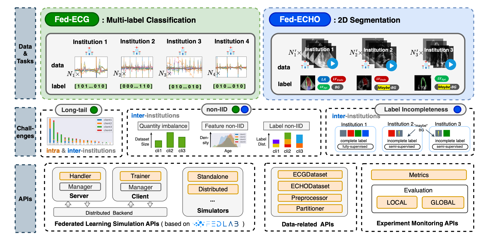

# FedCVD
The First Real-World Federated Learning Benchmark on Cardiovascular Disease Data

## Framework



## Installation
### Directory Structure
We recommend the user to use `FedCVD` following the directory structure below:

    data:  store the raw data and preprocessed data for each client;
    code:  use `FedCVD` in this directory;
    output: store results and log files。
The directory structure is shown below:
```grapha  
├── workspace  
│   └── data
│   │   ├── ECG  
│   │   │   ├── raw
│   │   │   │   ├── SPH
│   │   │   │   ├── PTB
│   │   │   │   ├── SXPH
│   │   │   │   ├── G12EC
│   │   │   ├── preprocessed
│   │   │   │   ├── client1
│   │   │   │   ├── client2
│   │   │   │   ├── client3
│   │   │   │   ├── client4
│   │   ├── ECHO    
│   │   │   ├── raw
│   │   │   │   ├── CAMUS
│   │   │   │   ├── ECHONET
│   │   │   │   ├── HMCQU
│   │   │   ├── preprocessed
│   │   │   │   ├── client1
│   │   │   │   ├── client2
│   │   │   │   ├── client3
│   ├── output  
│   └── code  
│       └── FedCVD
```  

You can run scripts below to create the directory structure:

```bash
mkdir workspace  
cd workspace  
mkdir data code output
cd data
mkdir -p ECG/raw ECG/preprocessed ECHO/raw ECHO/preprocessed
cd ECG/raw
mkdir SPH PTB SXPH G12EC
cd ../../ECHO/raw
mkdir CAMUS ECHONET HMCQU
cd ../../../
cd code  
```  
### Data Downloading
 Datasets for **Fed-ECG** can be downloaded from the URLs below:
 - client1: [SPH](https://springernature.figshare.com/collections/A_large-scale_multi-label_12-lead_electrocardiogram_database_with_standardized_diagnostic_statements/5779802/1)
 - client2: [PTB-XL](https://physionet.org/content/ptb-xl/1.0.3/)
 - client3: [SXPH](https://physionet.org/content/ecg-arrhythmia/1.0.0/)
 - client4: [G12EC](https://physionet.org/content/challenge-2020/1.0.2/)

Datasets for **Fed-ECHO** can be downloaded from the URLs below:
 - client1: [CAMUS](https://humanheart-project.creatis.insa-lyon.fr/database/#collection/6373703d73e9f0047faa1bc8)
 - client2: [ECHONET-DYNAMIC](https://echonet.github.io/dynamic/index.html#access)
 - client3: [HMC-QU](https://www.kaggle.com/datasets/aysendegerli/hmcqu-dataset/data)

Note that a Stanford AIMI account is required to access the ECHONET-DYNAMIC dataset and a Kaggle account is required to access the HMC-QU dataset.
### Data Preprocessing
Make sure the data is stored in the correct directory structure. The reference structure is shown below:
- **SPH** directory must contain the following files or directories:
```grapha
├── SPH
│   ├── ...
│   ├── metadata.csv
│   ├── records
│   │   ├── A00001.h5
│   │   ├── ...
│   │   └── A25770.h5
```
- **PTB** directory must contain the following files or directories:
```grapha
├── PTB
│   ├── ...
│   ├── ptbxl_database.csv
│   ├── records500
│   │   ├── 00000
│   │   │   ├── 00001_hr.dat
│   │   │   ├── 00001_hr.hea
│   │   │   └── ...
│   │   ├── ...
│   │   └── 21000
```
- **SXPH** directory must contain the following files or directories:
```grapha
├── SXPH
│   ├── ...
│   ├── WFDBRecords
│   │   ├── 01
│   │   │   ├── 010
│   │   │   │   ├── JS00001.hea
│   │   │   │   ├── JS00001.mat
│   │   │   │   └── ...
│   │   │   ├── ...
│   │   ├── ...
│   │   └── 46
```
- **G12EC** directory must contain the following files or directories:
```grapha
├── G12EC
│   ├── g1
│   │   ├── E00001.hea
│   │   ├── E00001.mat
│   │   └── ...
│   ├── ...
│   └── g11
```
- **CAMUS** directory must contain the following files or directories:
```grapha
├── CAMUS
│   ├── training
│   │   ├── patient0001
│   │   ├── ...
│   │   └── patient0450
│   ├── testing
│   │   ├── patient0001
│   │   ├── ...
│   │   └── patient0050
```
- **ECHONET** directory must contain the following files or directories:
```grapha
├── ECHONET
│   ├── ...
│   ├── FileList.csv
│   ├── VolumeTracings.csv
│   ├── Videos
│   │   ├── 0X1A0A263B22CCD966.avi
│   │   └── ...
```
- **HMCQU** directory must contain the following files or directories:
```grapha
├── HMCQU
│   ├── ...
│   ├── A4C.xlsx
│   ├── HMC-QU
│   │   ├── A4C
│   │   │   ├── ES0001 _4CH_1.avi
│   │   │   └── ...
│   ├── LV Ground-truth Segmentation Masks
│   │   ├── Mask_ES0001 _4CH_1.mat
│   │   └── ...
```
After downloading the data, you can run the following scripts to preprocess and split the data:

```bash
cd code/FedCVD/
bash scripts/preprocess/preprocess.sh
bash scripts/preprocess/split.sh
```

### Environment Setup
You can use the following scripts to set up the environment:

```bash
cd code/FedCVD/
conda create -n fedcvd_env python=3.11 -y
conda activate fedcvd_env
pip install -r requirements.txt
```

## Usage
You can run the scripts in the `code/FedCVD/scripts` directory to reproduce our experiments.
